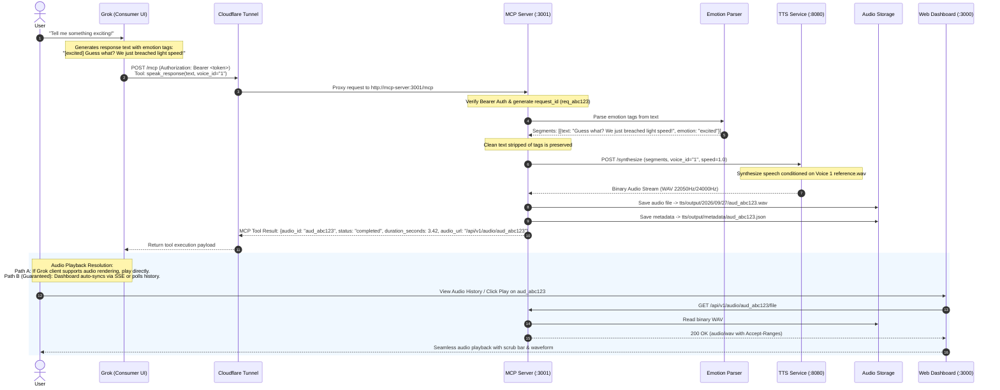

# EchoMCP — System Architecture Document
**Project:** Grok Voice Bridge (EchoMCP)  
**Version:** 1.0.0  
**Phase:** Phase 0 (Architecture & Contracts)  
**Status:** Approved Specification  

---

## 1. Executive Summary & Objective

**EchoMCP (Grok Voice Bridge)** provides a local, expressive custom-voice layer for the user's standard Grok consumer chat interface via the Model Context Protocol (MCP).

### Core Philosophical Invariant
- **Grok remains the brain:** Grok owns conversation memory, persona, contextual understanding, world knowledge, and text response generation.
- **EchoMCP owns speech delivery:** EchoMCP owns speech synthesis, emotion and prosody interpretation, custom voice cloning profiles, filesystem-backed audio persistence, audio history replay, and local system observability.
- **Strict Separation:** EchoMCP **never** duplicates Grok's conversation memory, **never** injects an extra LLM or chatbot UI, and **never** performs RAG or vector database operations.

---

## 2. High-Level Architecture Diagram

```
                                    INTERNET
                                       │
                                       ▼
                       ┌───────────────────────────────┐
                       │             GROK              │
                       │   Consumer Chat Interface     │
                       │   (Context, Memory, Brain)    │
                       └───────────────┬───────────────┘
                                       │
                                  MCP Tool Call
                          POST /mcp (speak_response)
                                       │
                                       ▼
                       ┌───────────────────────────────┐
                       │       CLOUDFLARE TUNNEL       │
                       │   (Public HTTPS Ingress)      │
                       └───────────────┬───────────────┘
                                       │ (Secure Proxy)
                                       ▼
  ══════════════════════════ LOCAL DOCKER NETWORK ══════════════════════════
  grok-voice-network

  ┌────────────────────────────────────────────────────────────────────────┐
  │                           MCP SERVER (:3001)                           │
  │                                                                        │
  │  ┌───────────────────────┐          ┌───────────────────────────────┐  │
  │  │ Bearer Authentication │          │ Streamable HTTP Transport     │  │
  │  └───────────┬───────────┘          └───────────────┬───────────────┘  │
  │              │                                      │                  │
  │              ▼                                      ▼                  │
  │  ┌──────────────────────────────────────────────────────────────────┐  │
  │  │                      MCP Tool Dispatcher                         │  │
  │  │                   Tool: speak_response(...)                      │  │
  │  └──────────────────────────────────┬───────────────────────────────┘  │
  │                                     │                                  │
  │                                     ▼                                  │
  │  ┌──────────────────────────────────────────────────────────────────┐  │
  │  │                        Speech Service                            │  │
  │  │  - Request ID & Latency Tracking                                 │  │
  │  │  - Input Validation (text length, formats, speed)                │  │
  │  └───────────┬──────────────────────────────────────┬───────────────┘  │
  │              │                                      │                  │
  │              ▼                                      ▼                  │
  │  ┌───────────────────────┐          ┌───────────────────────────────┐  │
  │  │ Emotion/Prosody Parser│          │     Audio Service             │  │
  │  │ [amused], [whisper].. │          │  - Filesystem persistence     │  │
  │  └───────────┬───────────┘          │  - JSON metadata index        │  │
  │              │                      │  - Range-request replay       │  │
  │              ▼                      └───────────────┬───────────────┘  │
  │  ┌──────────────────────────────────────────────┐   │                  │
  │  │ TTSProvider Abstraction (Base Interface)     │   │                  │
  │  └───────────────────┬──────────────────────────┘   │                  │
  │                      │                              │                  │
  │                      ▼                              │                  │
  │  ┌──────────────────────────────────────────────┐   │                  │
  │  │ CosyVoiceProvider (HTTP Client / Driver)     │   │                  │
  │  └───────────────────┬──────────────────────────┘   │                  │
  └──────────────────────┼──────────────────────────────┼──────────────────┘
                         │                              │
                    Internal HTTP                       │
                    POST /synthesize                    │
                         │                              │
                         ▼                              │
  ┌──────────────────────────────────────────┐          │
  │           TTS SERVICE (:8080)            │          │
  │  - Isolated container (No Public Access) │          │
  │  - Model: CosyVoice-300M-Instruct (PyTorch)│          │
  │  - Reference Voice 1: reference.wav      │          │
  │  - Output: 22050Hz/24000Hz PCM/WAV       │          │
  └──────────────────────┬───────────────────┘          │
                         │                              │
                         └───────────────┬──────────────┘
                                         │ Writes WAV & JSON
                                         ▼
  ┌────────────────────────────────────────────────────────────────────────┐
  │                      LOCAL AUDIO & VOICE STORE                         │
  │                                                                        │
  │   tts/output/YYYY/MM/DD/aud_<id>.wav                                   │
  │   tts/output/metadata/aud_<id>.json                                    │
  │   tts/voices/1/reference.wav                                           │
  │   tts/voices/1/metadata.json                                           │
  └────────────────────────────────────────────────────────────────────────┘
                                         ▲
                                         │ Replay & Manage
  ┌──────────────────────────────────────┴─────────────────────────────────┐
  │                         WEB DASHBOARD (:3000)                          │
  │  React 18 + TypeScript + Vite + TailwindCSS                            │
  │  - System Status (MCP, TTS, Voice 1, Audio Store)                      │
  │  - Voice 1 Reference Management & Upload                               │
  │  - Speech Tester (Emotion Tag Sandbox & Speed/Format Controls)         │
  │  - Persistent Audio History & Full HTML5 Audio Replay (Play/Pause/Seek)│
  └────────────────────────────────────────────────────────────────────────┘
```

---

## 3. End-to-End Execution Sequence

The sequence below illustrates what happens during a real Grok conversational interaction:



---

## 4. Service Boundaries & Network Isolation

The system consists of three distinct containerized services connected by a custom bridge network `grok-voice-network`.

| Service | Container Name | Internal Port | Exposed Port | Purpose | Security Posture |
| :--- | :--- | :--- | :--- | :--- | :--- |
| **MCP Server** | `echomcp-server` | `3001` | `3001:3001` | FastAPI, MCP Streamable HTTP, Auth, Speech Orchestration | **Ingress Target:** Exposed to localhost and proxied by Cloudflare Tunnel with Bearer Token auth. |
| **TTS Service** | `echomcp-tts` | `8080` | `None` (Internal Only) | PyTorch, CosyVoice-300M-Instruct neural engine, audio synthesis | **Isolated:** Strictly internal to `grok-voice-network`. NEVER mapped to host or public internet. |
| **Web Dashboard**| `echomcp-frontend` | `80` (or `3000`) | `3000:80` | React/Vite SPA for system administration and audio replay | **Local Only:** Bound to `127.0.0.1:3000`. Not proxied via Cloudflare. |

### Ingress & Cloudflare Tunnel Scope
- Cloudflare Tunnel connects directly to `http://mcp-server:3001` (or `http://localhost:3001` in local mode).
- Public access is strictly confined to `POST /mcp`.
- All administrative endpoints (`/api/v1/*`, `/ready`, `/health`) require internal access or authenticated sessions.

---

## 5. Architectural Subsystems

### 5.1 MCP Transport & Protocol
- Implements the official **Model Context Protocol (MCP)** specification using the Python MCP SDK.
- Transport: **Streamable HTTP transport** (`POST /mcp` with Server-Sent Events / chunked transfer capability).
- Tool Exposure: Exactly **one** speech tool initially: `speak_response`.
- Statelessness: MCP requests are stateless. No conversational context is retained across calls.

### 5.2 Emotion / Prosody Parser Subsystem
- **Controlled Vocabulary:** `[happy]`, `[amused]`, `[excited]`, `[sad]`, `[angry]`, `[whisper]`, `[laughing]`, `[pause]`.
- **Parsing Invariants:**
  1. Identifies supported tags case-insensitively.
  2. Strips tags completely from the spoken output (tags must **never** be voiced literally).
  3. Preserves punctuation, word order, and spacing exactly.
  4. Unknown tags (e.g. `[sarcastic]`, `[robot]`) are safely filtered out and logged as warnings rather than crashing the parser or being read aloud.
  5. Outputs structured segments containing the text snippet and the assigned emotion/prosody attribute.

### 5.3 TTS Provider Abstraction
To avoid vendor lock-in to CosyVoice, all synthesis operations pass through an abstract base class:

```python
class TTSProvider(ABC):
    @abstractmethod
    async def health(self) -> ProviderHealth: ...

    @abstractmethod
    async def synthesize(
        self,
        segments: list[EmotionSegment],
        voice_id: str,
        speed: float,
        output_format: AudioFormat,
    ) -> SynthesisResult: ...

    @abstractmethod
    async def register_voice(self, voice_id: str, reference_path: Path) -> VoiceRegistrationResult: ...

    @abstractmethod
    async def delete_voice(self, voice_id: str) -> bool: ...

    @abstractmethod
    async def list_voices(self) -> list[VoiceInfo]: ...
```

- Initial implementation: `CosyVoiceProvider`.
- Test implementation: `MockTTSProvider` (generates valid test WAV headers without running PyTorch inference).
- Future swappability: Fish Audio, Orpheus, F5-TTS, or Piper can be added by implementing `TTSProvider` with zero changes to the MCP tool layer.

### 5.4 Audio Storage & Retention Engine
- **Structure:** Hierarchical filesystem storage based on UTC creation date:
  - Audio files: `tts/output/YYYY/MM/DD/aud_<uuid>.wav`
  - Metadata files: `tts/output/metadata/aud_<uuid>.json`
- **Metadata Attributes:**
  - `audio_id`: Unique identifier (e.g. `aud_01J8XK...`)
  - `text`: Clean spoken text string
  - `voice_id`: Active voice identifier (`"1"`)
  - `format`: `"wav"` or `"mp3"`
  - `duration_seconds`: Measured audio duration
  - `sample_rate`: Dynamic rate read directly from generated audio (e.g., 22050 or 24000 Hz)
  - `channels`: 1 (Mono)
  - `created_at`: ISO 8601 timestamp
  - `file_path`: Relative filesystem path
- **Retention Worker:** Configurable retention via `AUDIO_RETENTION_ENABLED` (default: `false` in development) and `AUDIO_RETENTION_DAYS` (default: `30`). When enabled, a background cleanup routine prunes files older than the retention threshold.

### 5.5 Job & Concurrency Management
- V1 utilizes `InMemoryJobManager` with `asyncio.Semaphore` to cap concurrent inference calls based on available GPU/CPU capacity.
- Redis is deliberately omitted in V1 to avoid unneeded operational complexity. An abstract `JobManager` interface is established so Redis can be swapped in if horizontal worker scaling becomes necessary.

---

## 6. Observability & Latency Instrumentation

Every request entering the MCP server receives a cryptographically secure, ULID/UUID-based `request_id` (e.g., `req_01J8...`).

### Timing Breakdown
For every synthesis operation, the system records:
1. `t_received`: Timestamp when the HTTP request hits the MCP endpoint.
2. `t_mcp_start`: Timestamp when request parsing and auth validation complete.
3. `t_tts_start`: Timestamp when HTTP payload is dispatched to the TTS container.
4. `t_tts_end`: Timestamp when the final audio chunk is received back from TTS.
5. `t_storage_saved`: Timestamp when audio binary and JSON metadata are safely committed to disk.
6. `t_response_complete`: Timestamp when MCP response is serialized and returned.

### Structured Log Format
```json
{
  "timestamp": "2026-09-27T14:32:10.123Z",
  "request_id": "req_01J8XK9R2Q0000000000000001",
  "operation": "speak_response",
  "voice_id": "1",
  "text_length": 84,
  "tts_provider": "cosyvoice",
  "metrics": {
    "mcp_overhead_ms": 12.4,
    "tts_latency_ms": 3210.8,
    "storage_latency_ms": 8.1,
    "total_latency_ms": 3231.3
  },
  "status": "success",
  "error": null
}
```

---

## 7. Security Architecture

1. **Bearer Token Authentication:**
   - All incoming calls to `/mcp` must present `Authorization: Bearer <MCP_AUTH_TOKEN>`.
   - Unauthorized calls immediately return HTTP 401 Unauthorized before any text processing.
2. **Payload Validation:**
   - Maximum text length enforced: `MAX_TEXT_LENGTH = 5000` characters.
   - Text cannot be empty or solely whitespace.
   - Speed clamped strictly between `0.5` and `2.0`.
   - Audio format constrained to `enum [wav, mp3]`.
3. **Filesystem Sandboxing:**
   - Path resolution uses `os.path.realpath` with strict containment validation within `tts/output` and `tts/voices/1`.
   - Path traversal attempts (`../`) are detected and rejected.
4. **Zero Remote Execution:**
   - No `eval()`, `exec()`, or subshell commands are executed from request payloads.
   - No arbitrary URL fetching.

---

## 8. Architectural Consistency Verification Checklist

- [x] Grok conversation memory is uncoupled from EchoMCP.
- [x] Streamable HTTP MCP transport specified at `POST /mcp`.
- [x] Voice ID 1 hard-coded as initial default target without premature multi-tenant complexity.
- [x] Emotion vocabulary specified with strict tag-stripping invariants.
- [x] TTS Provider interface decoupled from concrete CosyVoice engine.
- [x] Persistent filesystem audio storage with structured metadata schema.
- [x] Complete latency instrumentation with `request_id` end-to-end tracing.
- [x] Network topology isolates TTS service from public exposure.
- [x] Web dashboard operates as administrative and replay console, never a chatbot.
